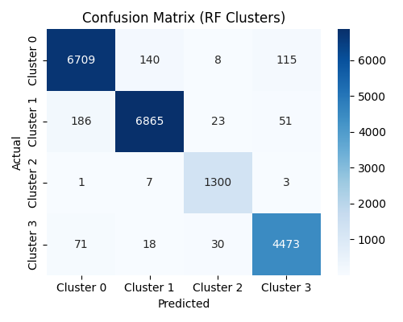

# Patient Clustering and Risk Profiling Using Machine Learning  
- [Introduction](#introduction)
- [Dataset](#dataset)
- [Repository Structure](#repository-structure)
- [Installation](#installation)
- [Methodology](#methodology)
---

## Introduction

Healthcare systems often struggle to identify groups of patients with similar risk profiles. Wide variation in demographics, lifestyle behaviors, chronic conditions, and medical utilization makes traditional risk-scoring approaches incomplete or inaccurate.

The goal of this project was to apply modern machine learning techniques to:

1. Identify natural patient segments based on observed characteristics  
2. Profile and compare these patient segments  
3. Build a predictive model capable of assigning new individuals to these clusters  

This approach provides a structured framework for population health analytics, resource allocation, and management of high-risk patient groups.

---

## Dataset

The project uses a publicly available dataset from Kaggle containing:

- Over **100,000 patient records**  
- **54 demographic, socioeconomic, lifestyle, and clinical features**

Dataset link:  
https://www.kaggle.com/datasets/mohankrishnathalla/medical-insurance-cost-prediction

**Note: The dataset is already provided, so no download is required.**

Below is an example preview of the encoded dataset:


---

## Repository Structure
```
Patient-Clustering-Project/
│
├── data/ # Raw and processed datasets
│ ├── medical_insurance.csv
│ ├── cluster_profiles_full.csv
│
├── notebooks/ # Jupyter notebooks for analysis and modeling
│ ├── Insurance Cost & Risk Analysis.ipynb
│ └── Patient Clustering.ipynb
│
├── vizualizations/ # All project images and graphics
│ ├── EDA/ # Exploratory data analysis plots
│ └── Results/ # Model outputs (ROC curves, confusion matrices, etc.)
│
├── LICENSE
└── README.md
```

## Installation
### Instructions for Running the Project

Follow the steps below to set up the environment, access the data, and reproduce the clustering and modeling results.

---

### 1. Clone the Repository
```
git clone https://github.com/carlo88uy/Patient-Clustering-Project.git
cd Patient-Clustering-Project
```

---

### 2. Install Required Python Libraries

Ensure you have Python 3.8+ installed.  
Then manually install the core libraries used in this project:

These libraries support preprocessing, visualization, clustering, and modeling.

---

### 3. Download the Dataset
The dataset required for this project is already included in the repository.


*Any additional datasets generated during analysis have been placed in 'data/' analysis

---

### 4. Open the Jupyter Notebooks

Launch Jupyter Notebook:


Then open:

- `notebooks/Insurance Cost & Risk Analysis.ipynb`  
- `notebooks/Patient Clustering.ipynb`  

Each notebook walks through the full process of preprocessing, clustering, profiling, and supervised classification.

---

### 5. Reproducing the Analysis

Run each notebook cell in order:

1. Load and inspect the data  
2. Apply preprocessing and feature engineering  
3. Perform K-Means clustering  
4. Profile each cluster  
5. Train the Random Forest classifier  
6. Evaluate model performance (confusion matrix, ROC curves, AUC)

All generated visualizations will be saved to:
vizualizations/EDA/...
vizualizations/Results/...

---

### 6. Viewing the Visualizations

The repository includes two main visualization folders:

- **EDA plots:**  
  `vizualizations/EDA/`

- **Model results (confusion matrices, ROC curves, etc.):**  
  `vizualizations/Results/`
---

# Methodology

---
## Data Cleaning and Preprocessing

Preprocessing included the following steps:

- Imputation of missing values  
- Standardization of numeric features  
- One-hot encoding of categorical variables  

After preprocessing, the dataset expanded to over **80 engineered features**.

Because this dimensionality is too large for K-Means clustering, we used a correlation matrix to identify the most relevant variables for segmentation.

---

## Phase 1 — Unsupervised Learning (K-Means Clustering)

### Feature Selection  
We selected key demographic, lifestyle, clinical, and chronic condition variables based on:

- Correlation analysis  
- Avoidance of multicollinearity  
- Clinical interpretability  

### Determining Optimal K  
K-Means clustering was applied, and an elbow plot was used to select **k = 4** as the optimal number of clusters.


### Cluster Profiling  
After clustering, each group was profiled using:

- Chronic disease burden  
- BMI, blood pressure, LDL, HbA1c  
- Lifestyle behaviors (smoking, alcohol use)  
- Annual medical cost  
- General healthcare utilization  

These profiles allowed us to interpret each cluster as a distinct patient type.

---

## Phase 2 — Supervised Learning (Predicting Cluster Labels)

To predict cluster membership for new patients and validate cluster separability, we trained a **Random Forest classifier**.

### Model Details

- Same preprocessing pipeline as clustering  
- 80/20 stratified train-test split  
- 250 trees, minimum leaf size of 5  
- Balanced class weighting  
- Evaluation using:
  - Confusion matrix  
  - Classification report  
  - Multiclass ROC curves  
  - AUC scores  



### Model Performance

- **Accuracy:** 0.9673  
- ROC curves for each cluster displayed **AUC values > 0.99**, indicating excellent separability between patient groups.


---
## Use of Libraries and Methods

All work was completed using standard Python libraries:

- pandas  
- NumPy  
- scikit-learn  
- matplotlib  
- seaborn

These tools ensured clean, efficient preprocessing and modeling pipelines.

No external advanced machine learning packages were used.

---

## Findings

### Key Insights

- **Chronic disease burden outweighs age** as a predictor of medical risk.  
  Older adults without chronic conditions had lower risk profiles than younger individuals with at least one chronic disease.

- **Sex differences in annual cost were negligible.**

- **BMI alone is not a strong predictor of cost** when age and chronic diseases are accounted for.

- **Income had minimal effect** on medical expenditure.  
  This may be due to higher-income individuals having better insurance coverage.

- The Random Forest model's strong performance (**accuracy = 0.9673**) validates the robustness of the cluster groups.

### Important Predictors Identified

- Chronic diseases  
- Blood pressure  
- BMI  
- LDL and HbA1c levels  
- Smoking and alcohol use  
- Age  

---

# License
This project is licensed under the **MIT License**

## Acknowledgements
Feature exploration was informed by an open-source Kaggle notebook by Lighton N. Kalumba (Health Cost Prediction ML 95% + Full Analysis).
All modeling, clustering, and evaluation were implemented independently.
